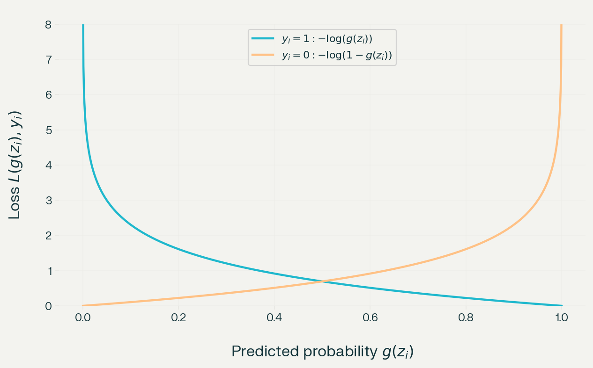

+++
title = "What's Logistic Regression?"
date = 2026-09-14
description = "Logistic regression from pure mathematics: model, cost function, and gradient descent from scratch."
tags = ["ML-from-scratch", "logistic-regression", "gradient-descent", "math"]
categories = ["Machine-Learning"]
math = true
+++

Previously, I talked about how linear regression worked and implemented it in Python from scratch. This post is about understanding and implementing logistic regression from scratch. I will talk about what logistic regression is, how it works, and why we use it.

# Intro

Unfortunately or fortunately, the field of ML cannot be discussed without understanding the underlying mathematics on which it is built.

Similar to linear regression, we are approximating some parameters and then using them to make predictions. However, unlike linear regression, we are not predicting a particular value but rather trying to classify an input into a category.

Therefore, the name is actually misleading. It is a classification algorithm, more specifically, a binary classification algorithm. The output is not a continuous value; rather, it is a binary output such as 0/1 or yes/no.

# Math

## Idea

The core idea is to take a linear combination

$$
z=wx+b
$$

and pass it through

$$
g(z)=\frac{1}{1+e^{-z}},
$$

which is known as the sigmoid or logistic function.

The sigmoid function takes the real-valued continuous output $z$ and compresses it to a value in $(0,1)$. This value can be interpreted as a probability:

$$
g(z)=P(y=1\mid x;w,b)
$$

>[!NOTE]
>It is the probability that the class is $y=1$ when the input feature is $x$, given the parameters $w$ and $b$.

We can also have more than one feature. For example, if we have two input features,

$$
z=w_1x_1+w_2x_2+b.
$$

Therefore,

$$
g(z)=\frac{1}{1+e^{-(w_1x_1+w_2x_2+b)}}.
$$

This can be generalised to $n$ features using vectors:

$$
\begin{aligned}
z&=\vec{w}\cdot\vec{x}+b,\\
g(z)&=\frac{1}{1+e^{-(\vec{w}\cdot\vec{x}+b)}}.
\end{aligned}
$$

## Making Predictions

Now that we have the output of $g(z)$ from the sigmoid function, where $0<g(z)<1$, we can apply a threshold to make predictions:

$$
\begin{aligned}
g(z)\geq0.5&\implies\hat{y}=1,\\
g(z)<0.5&\implies\hat{y}=0.
\end{aligned}
$$

Here, we use $0.5$ as the threshold.

>[!NOTE]
>### Decision Boundary
>
>$$
>\vec{w}\cdot\vec{x}+b=0\implies g(z)=0.5.
>$$
>
>This is called the decision boundary. It is the line where the model is almost neutral between $y=0$ and $y=1$.
>
>It splits the input space into two regions. Points on one side are classified as $0$, while points on the other side are classified as $1$.

## Cost Function

The cost function measures how well the parameters fit the training data. A reasonable idea might be to use the same cost function as linear regression, namely MSE:

$$
C(w,b)=\frac{1}{m}\sum_{i=1}^{m}\left(g(z_i)-y_i\right)^2.
$$

Although MSE can technically be used with binary labels, combining it with the sigmoid function produces an objective that is generally non-convex in the model parameters. Consequently, gradient descent may encounter local minima or flat regions.

A new cost function is needed, or more specifically, a new loss function $L(g(z_i),y_i)$ is needed, such that the resulting cost function $C(w,b)$ is convex.

### Loss Function

The loss function should satisfy the following requirements:

1. Penalise predictions that are far from the true label.
2. Reward predictions that are close to the true label.

Mathematically, we use the following piecewise function:

$$
L(g(z_i),y_i)=
\begin{cases}
-\log(g(z_i)) & \text{if } y_i=1,\\
-\log(1-g(z_i)) & \text{if } y_i=0.
\end{cases}
$$

These are the graphs of the two functions:



If $y_i=1$ and the model predicts $0.1$, then

$$
-\log(0.1)\approx 1,
$$

which is a high loss. If $y_i=0$ and the model predicts $0.95$, then

$$
-\log(1-0.95)=\log(20),
$$

which is also a high loss.

This can be rewritten as:

$$
L(g(z_i),y_i)=-y_i\log(g(z_i))-(1-y_i)\log(1-g(z_i)).
$$

Notice that this is the same as the piecewise function. When $y_i=0$, the first term disappears, and when $y_i=1$, the second term disappears.

Now that we have the cost function, we can write it as follows:

$$
C(w,b)=\frac{1}{m}\sum_{i=1}^{m}
\left[-y_i\log(g(z_i))-(1-y_i)\log(1-g(z_i))\right].
$$

## Minimizing the Cost Function

The process of minimizing this cost function is the same as in linear regression: we apply gradient descent. At each iteration,

$$
\begin{aligned}
w&=w-\alpha\frac{\partial C(w,b)}{\partial w},\\
b&=b-\alpha\frac{\partial C(w,b)}{\partial b}.
\end{aligned}
$$

Before putting this into code, let us simplify the derivatives of $C(w,b)$ with respect to $w$ and $b$:

$$
\begin{aligned}
z_i&=\vec{w}\cdot\vec{x_i}+b,\\
g(z_i)&=\frac{1}{1+e^{-(\vec{w}\cdot\vec{x_i}+b)}},\\
L(g(z_i),y_i)&=-y_i\log(g(z_i))-(1-y_i)\log(1-g(z_i)),\\
C(w,b)&=\frac{1}{m}\sum_{i=1}^{m}L(g(z_i),y_i).
\end{aligned}
$$

Differentiating the loss function,

$$
\begin{aligned}
\frac{\partial L}{\partial w_j}
&=\frac{\partial L}{\partial g_i}
\cdot\frac{\partial g_i}{\partial w_j}\\
&=\frac{\partial L}{\partial g_i}
\cdot\frac{\partial g_i}{\partial z_i}
\cdot\frac{\partial z_i}{\partial w_j}\\
&=\left(
\frac{g_i-y_i}{\cancel{g_i(1-g_i)}}
\right)
\cdot\cancel{g_i(1-g_i)}
\cdot x_{i,j}.
\end{aligned}
$$

Therefore,

$$
\frac{\partial C}{\partial w_j}
=\frac{1}{m}\sum_{i=1}^{m}(g_i-y_i)x_{i,j}.
$$

Similarly, for $b$,

$$
\frac{\partial C}{\partial b}
=\frac{1}{m}\sum_{i=1}^{m}(g_i-y_i).
$$

We do not have to worry about indexing across the input features because there is one weight for each feature, along with one bias term.

## Cooking the Code

[Dataset](https://www.kaggle.com/datasets/diaz3z/logistic-regression-dataset)

Our dataset has five fields, but we will only use `Age` and `EstimatedSalary` to predict `Purchased`. However, before using the data, we first standardise the continuous features so that they have comparable scales.

### Load Data

```python
import pandas as pd
import numpy as np
import matplotlib.pyplot as plt

df = pd.read_csv("User_Data.csv")

print(df.head())
print(df.columns)
```

### Extract Fields

```python
X = df[["Age", "EstimatedSalary"]].to_numpy(dtype=np.float64)
y = df["Purchased"].to_numpy(dtype=np.float64)
```

### Split into Training and Test Sets

```python
rng = np.random.default_rng(42)

indices = np.arange(len(X))
rng.shuffle(indices)

test_size = int(0.2 * len(X))

test_indices = indices[:test_size]
train_indices = indices[test_size:]

X_train = X[train_indices]
X_test = X[test_indices]

y_train = y[train_indices]
y_test = y[test_indices]
```

### Calculate the Mean and Standard Deviation

```python
mean = X_train.mean(axis=0)
std = X_train.std(axis=0)

if np.any(std == 0):
    raise ValueError("At least one feature has zero variance.")

X_train = (X_train - mean) / std
X_test = (X_test - mean) / std
```

### Visualisation with a Scatter Plot

```python
plt.scatter(
    X_train[y_train == 0, 0],
    X_train[y_train == 0, 1],
    color="tab:red",
    label="Class 0",
    s=20
)

plt.scatter(
    X_train[y_train == 1, 0],
    X_train[y_train == 1, 1],
    color="tab:green",
    label="Class 1",
    s=20
)

plt.xlabel("Standardised Age")
plt.ylabel("Standardised Estimated Salary")
plt.legend()
plt.show()
```

### Sigmoid Function

```python
def sigmoid(z):
    if z >= 0:
        return 1 / (1 + np.exp(-z))
    else:
        exp_z = np.exp(z)
        return exp_z / (1 + exp_z)
```

### Cost Function

```python
def cost_func(X, y, w, b):
    m = X.shape[0]
    cost_sum = 0.0
    epsilon = 1e-15

    for i in range(m):
        z = np.dot(w, X[i]) + b
        g = sigmoid(z)

        g = np.clip(g, epsilon, 1 - epsilon)

        cost_sum += (
            -y[i] * np.log(g)
            -(1 - y[i]) * np.log(1 - g)
        )

    return cost_sum / m
```

### Gradient Function

```python
def gradient_func(X, y, w, b):
    m, n = X.shape

    grad_w = np.zeros(n)
    grad_b = 0.0

    for i in range(m):
        z = np.dot(w, X[i]) + b
        g = sigmoid(z)
        error = g - y[i]

        grad_b += error

        for j in range(n):
            grad_w[j] += error * X[i, j]

    grad_w /= m
    grad_b /= m

    return grad_b, grad_w
```

### Gradient Descent Function

```python
def grad_des(X, y, alpha, iterations):
    _, n = X.shape

    w = np.zeros(n)
    b = 0.0

    for i in range(iterations):
        grad_b, grad_w = gradient_func(X, y, w, b)

        w -= alpha * grad_w
        b -= alpha * grad_b

        if i % 1000 == 0:
            print(f"{i}: {cost_func(X, y, w, b)}")

    return w, b
```

### Prediction Function

```python
def predict(X, w, b):
    m = X.shape[0]
    predictions = np.zeros(m)

    for i in range(m):
        z = np.dot(w, X[i]) + b
        g = sigmoid(z)

        predictions[i] = 1 if g >= 0.5 else 0

    return predictions
```

### Training and Testing

```python
learning_rate = 0.001
iterations = 10000

final_w, final_b = grad_des(
    X_train,
    y_train,
    learning_rate,
    iterations
)

predictions_train = predict(X_train, final_w, final_b)
predictions_test = predict(X_test, final_w, final_b)

print("Prediction shapes:")
print(predictions_train.shape, y_train.shape)
print(predictions_test.shape, y_test.shape)

accuracy_train = np.mean(predictions_train == y_train) * 100
accuracy_test = np.mean(predictions_test == y_test) * 100

print(f"Training accuracy: {accuracy_train:.2f}%")
print(f"Test accuracy: {accuracy_test:.2f}%")
```
### Plotting descion boundary
```python
x_values = np.linspace(
    X_train[:, 0].min(),
    X_train[:, 0].max(),
    100
)

y_values = -(final_w[0] * x_values + final_b) / final_w[1]

plt.scatter(
    X_train[y_train == 0, 0],
    X_train[y_train == 0, 1],
    color="tab:red",
    label="Class 0"
)

plt.scatter(
    X_train[y_train == 1, 0],
    X_train[y_train == 1, 1],
    color="tab:green",
    label="Class 1"
)

plt.plot(
    x_values,
    y_values,
    color="black",
    label="Decision boundary"
)

plt.xlabel("Standardised Age")
plt.ylabel("Standardised Estimated Salary")
plt.legend()
plt.show()
```

This is a complete basic implementation of binary logistic regression using NumPy. The model learns a linear decision boundary and uses the sigmoid function to convert the linear score into a probability. In practical applications, we would also consider validation data, regularisation, class imbalance, numerical stability, and metrics beyond accuracy.