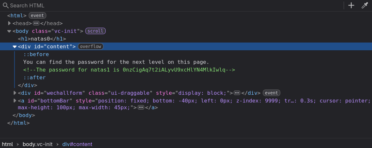

+++
title = "Natas Level 0"
date = 2026-06-21T00:00:00
description = "Natas Level 0: first look, inspecting the HTML, and finding the next password."
tags = ["Natas", "web", "security", "wargame"]
+++

### Natas Level 0

- **Username:** `natas0`  
- **Password:** `natas0`  
- **URL:** [http://natas0.natas.labs.overthewire.org](http://natas0.natas.labs.overthewire.org)

***

I started by opening the browser’s **Inspect** (right‑click → Inspect) and looking at the HTML.

As expected, the password for the next level is hidden in this page’s HTML.

***

[next level](../../natas/level_1)