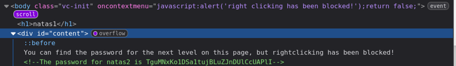

+++
title = "Natas Level 1"
date = 2026-06-21T00:00:00
description = "Natas Level 1: bypassing right-click blocking and finding the password in the HTML."
tags = ["Natas", "web", "security", "wargame"]
+++

[previous level](../../natas/level_0)

### Login

- **Password:** `0nzCigAq7t2iALyvU9xcHlYN4MlkIwlq`  
- **Username:** `natas1`  
- **URL:** [http://natas1.natas.labs.overthewire.org](http://natas1.natas.labs.overthewire.org)

***

Right-clicking is blocked, so just open DevTools with the shortcut. In Firefox, press `<F12>`; check the correct shortcut for your browser.

I usually start by reading through the HTML before checking anything else.

Looking at the `content` div under `body`, I found:

With this, we got the password for the next level.

***

[next level](../../natas/level_2)