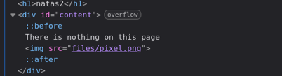
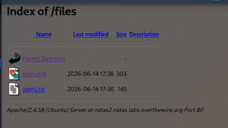
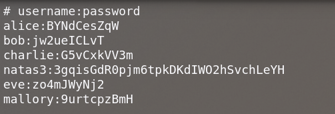

+++
title = "Natas Level 2"
date = 2026-06-21T00:00:00
description = "Natas Level 2: finding a hidden file by exploring the /files directory."
tags = ["otw", "natas", "file-exposure", "directory-exposure"]
+++

### Level 2

- **Username:** `natas2`  
- **URL:** [http://natas2.natas.labs.overthewire.org](http://natas2.natas.labs.overthewire.org)  
- **Password:** `TguMNxKo1DSa1tujBLuZJnDUlCcUAPlI`

***

When looking through the HTML, I found there is an image stored at `./files/pixel.png`:

With this, I checked out the PNG by visiting:  
`http://natas2.natas.labs.overthewire.org/files/pixel.png`

This wasn't particularly useful, so I checked what was at:  
`http://natas2.natas.labs.overthewire.org/files`

I wondered what was hiding in `user.txt`:

With that, I got the password for the next level.

[next level](../../natas/level_3)