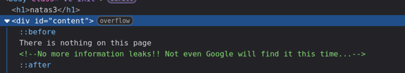

+++
title = "Natas Level 3"
date = 2026-06-21T00:00:00
description = "Natas Level 3: using robots.txt to find a hidden directory and the next password."
tags = ["otw", "natas", "robots.txt", "directory-exposure"]
+++

### Level 3

- **Username:** `natas3`  
- **URL:** [http://natas3.natas.labs.overthewire.org](http://natas3.natas.labs.overthewire.org)  
- **Password:** `3gqisGdR0pjm6tpkDKdIWO2hSvchLeYH`

***

This time, the hint hidden in the HTML is:



Interesting — maybe this has something to do with `robots.txt`, since Google uses it to specify which pages to index.

Let's check it at `http://natas3.natas.labs.overthewire.org/robots.txt`:

```text
User-agent: *
Disallow: /s3cr3t/
```

It disallows `/s3cr3t/` from being indexed. I should definitely check it out:

```text
Index of /s3cr3t
[ICO]	Name	Last modified	Size	Description
[PARENTDIR]	Parent Directory	 	- 	 
[TXT]	users.txt	2026-06-14 17:38 	40 	 
Apache/2.4.58 (Ubuntu) Server at natas3.natas.labs.overthewire.org Port 80
```

The `users.txt` file holds the password for the next level.

***

[next level](../../natas/level_4)