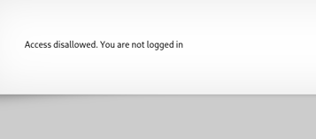
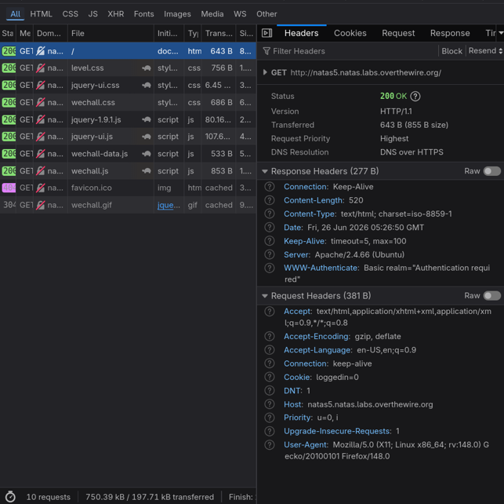
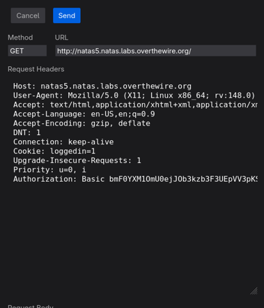

+++
title = "Natas Level 5"
date = 2026-06-25
description = "Natas Level 5: cookies"
tags = ["otw", "natas", "web security", "cookies"]
+++
[previous level <<<](../level_4)

# Natas Level 5: cookies
The page initially displays only an access-restricted message.

Inspecting the HTTP request reveals a cookie named `loggedin` with the value `0`. This is a client-controlled state variable, which means the server is trusting mutable input from the browser to determine whether the user is authenticated.

Initially, the client sends a request to the server:

Since cookies can be modified before a request is sent, I changed `loggedin=0` to `loggedin=1` and resent the request. The server accepted the altered value and returned the password.

>Never trust user input.
---
[next level >>>](../level_6)
