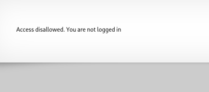
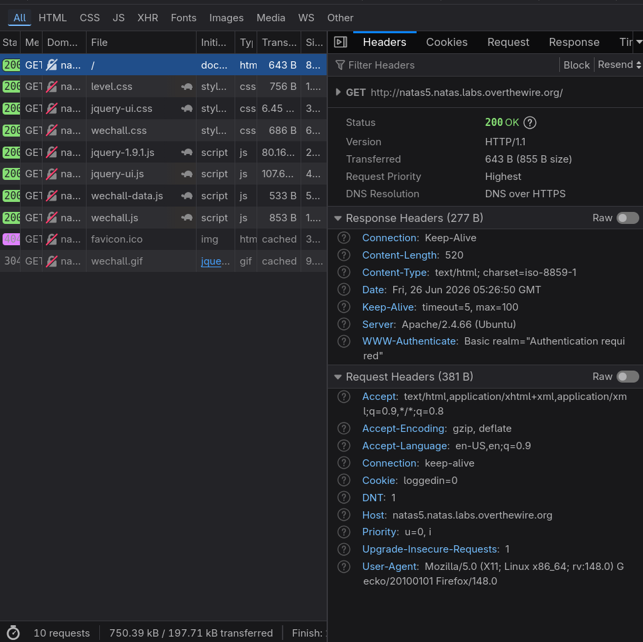
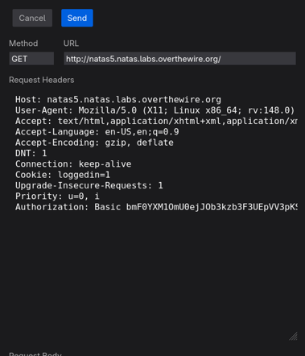

+++
title = "Natas Level 5"
date = 2026-06-25
description = "Natas Level 5: cookies"
tags = ["otw", "natas", "web security", "cookies"]
+++

## Natas 5 – devlog

The page loads with a simple “access restricted” message and nothing else.



Digging into the HTTP request, I spot a cookie:

```text
loggedin=0
```

That looks like a boolean flag the server uses to decide whether I’m authenticated. In other words, the site is storing auth state in a client‑controlled cookie.

Initial request from the browser:



Since cookies are under my control, I edit the request and change:

```text
loggedin=0 → loggedin=1
```

Then resend:



The server accepts `loggedin=1` as “authenticated” and immediately returns the password for the next level.

---

[next level >>>](../level_6)
