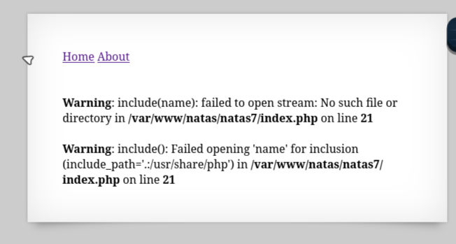

+++
title = "Level 7"
date = 2026-10-08
description = "Walkthrough for Natas 7"
tags = ["otw", "natas", "web security"]
+++

## Natas 7 – devlog

First thing I did was just poke around the site. The landing page has two links: **Home** and **About**. Nothing special, but inspecting the URLs shows a pattern:

- Home → `index.php?page=home`
- About → `index.php?page=about`

So the app is routing pages through a single `index.php` using a `page` query parameter.

Next, I tried passing something other than `home` or `about`:

```text
index.php?page=foo
```

That immediately threw an error mentioning `include()`.

At this point, my mental model was:

- The app does something like `include($page)` internally.
- Only `home` and `about` are “allowed” in the happy path.
- No permissions checks are performed on the page parameter.

From the Natas intro, I already knew the passwords live in `/etc/webpass/natas#`. For this level, that means `/etc/webpass/natas7`.

So the goal became: can I make the app include `/etc/webpass/natas7` instead of a normal page?

The script runs from somewhere like `/var/www/natas/natas7/`, so a relative path needs to climb out of that directory to reach the system root. Using `../` segments, I can walk up the directory tree and then drop into `/etc/webpass/`.

Hitting:

```text
index.php?page=../../../etc/webpass/natas7
```

made the server include the password file and print its contents in the page body. That string is the natas7 password.

---

[next page](../level_8/index.md)
